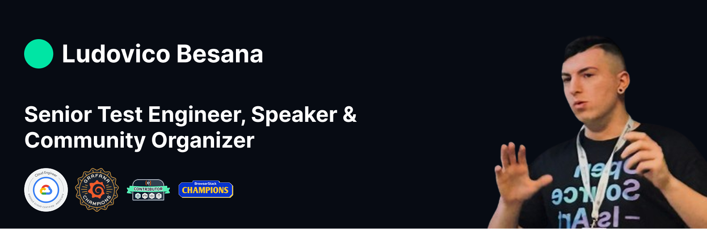

# Hi, I'm Ludovico 👋🏻



## 🤝 Meet Me Live

Here’s where you can find me in person (or virtually) in the coming months. If you’re attending one of these events, come say hi, I’d love to connect!

### 🎤 Speaking At
- **5 June 2025 — We Make Future 2025, Bologna 🇮🇹**  
  Hello Darwin: Does the Gender Gap Exist? “Team Yes” vs “Team No”
 👉 [Programme & tickets](https://www.wemakefuture.it/i/682edafcdfb761c0351c9fc6/)

- **6 June 2025 — We Make Future 2025, Bologna 🇮🇹**  
   The AI Bug: How to Test Applications with Output
 👉 [Programme & tickets](https://www.wemakefuture.it/s/67bc32de5e87e4097b578497/)

-  **16 June 2025 — Ministry of Testing Milan Meetup, Milan 🇮🇹**  
   Write Less, Test More: Mobile automation with Maestro
 👉 [Programme & tickets](https://www.meetup.com/it-IT/mot-milan/events/308062631/)

- **19 June 2025 — BCS SIGiST Summer Conference 2025, London / Online 🇬🇧**  
  Theme *Finding Calm in Chaos*: Applying Testing to a Changing World
  👉 [Programme & tickets](https://www.bcs.org/membership-and-registrations/member-communities/software-testing-specialist-group/conferences/bcs-sigist-summer-conference-2025/)


### 🧭 Attending
- **June 12 2025 - Google Cloud Summit, Milan 🇮🇹**
  👉 [Programme & tickets](https://cloudonair.withgoogle.com/events/google-cloud-summit-milan-2025)

- **June 14 2025 - DevFest Vicenza 2025, Vicenza 🇮🇹**
  👉 [Programme & tickets](https://gdg.community.dev/gdg-vicenza/)

- **June 18 2025 - AWS Summit Milano, Milan 🇮🇹**
  👉 [Programme & tickets](https://aws.amazon.com/it/events/summits/milano/)

- **June 20 2025 - Community Day, Milan 🇮🇹**
  👉 [Programme & tickets](https://www.techcommunityday.it/)

- **Oct 4, 5 2025 - DevFest Modena, Modena 🇮🇹**
 👉 [Programme & tickets](https://devfest.modena.it/)

> ✉️ DM me on [LinkedIn](https://linkedin.com/in/ludovicobesana) if you’d like to connect at one of these!

## 🔄 Repository refresh plan
I'm working to ensure *all* public projects on this profile are complete, polished, and truly valuable.
Each month, I dedicate time to one or more repositories: fixing bugs, updating dependencies, improving tests and documentation.

  👉 You can follow my progress by **following me on GitHub** and/or checking [this public dashboard](https://github.com/users/ludovicobesana/projects/8).

### 📬 Let’s connect
[Website](https://ludovicobesana.com) • [LinkedIn](https://linkedin.com/in/ludovicobesana) • [X / Twitter](https://x.com/ludovicobesana)

<p align="left">
  
</p>

<!--
# 🎉 Community Day 2025 –  See you in Milan!

<a href="https://www.techcommunityday.it/"></a>

### 👉 https://www.techcommunityday.it/

---
## 💜 Become Part of Something Great: Join <a href="https://codingbunker.it/">Coding Bunker</a>!
<a href="https://www.meetup.com/coding-bunker/join/"></a>

👩‍💻 Collaborate, Learn, and Grow Together
- 🚀 Connect with like-minded developers and tech enthusiasts.
- 💡 Explore open-source projects and innovative ideas.
- 🎓 Learn from workshops, talks, and hands-on experiences. 

**🌟 Ready to code, create, and collaborate?**

- 👉 [Join us on Meetup!](https://www.meetup.com/coding-bunker/join/)
- 👉 [Check out our open-source projects and contribute on GitHub :octocat:](https://github.com/Coding-Bunker)


<!--
# 📖 Recommended Articles

### [Nearform tech experts attended Codemotion 2024: Read about their experiences](https://www.nearform.com/digital-community/nearform-tech-experts-attended-codemotion-2024-read-about-their-experiences/)

<a href="https://www.nearform.com/digital-community/nearform-tech-experts-attended-codemotion-2024-read-about-their-experiences/"></a>

A group of Nearformers gave talks, learned from the event’s other speakers and attended workshops

👉 [Read the full article](https://www.nearform.com/digital-community/nearform-tech-experts-attended-codemotion-2024-read-about-their-experiences/)


### [Streamline Your Mobile Testing with Maestro](https://www.nearform.com/digital-community/streamline-your-mobile-testing-with-maestro/)

<a href="https://www.nearform.com/digital-community/streamline-your-mobile-testing-with-maestro/"></a>

Discover how to enhance your mobile testing workflow with Maestro, a powerful tool designed to make your testing process more efficient and effective.

👉 [Read the full article](https://www.nearform.com/digital-community/streamline-your-mobile-testing-with-maestro/)


---

### Reach me on:
<p>
<a href="https://www.linkedin.com/in/ludovicobesana/">
          
</a>
-->
  <!--
```js
if awake:
  code()
elif tired:
  drink_coffe()
```
-->
<!---->
<!--
I'm a 🐞 QA Engineer and 💻 Developer who loves to automate and find bugs. 

I'm a 🐧 Linux lover, but 🍎 macOS is so beautiful that it can't not be used.

I'm currently working on:
-   :octocat: [GitHub](https://github.com/ludovicobesana?tab=repositories): To ensure that you can find useful resources here 


Here are the languages, frameworks, and libraries that I'm most comfortable using:

-   🐍 Python: Is my favourite language
-   📒 JavaScript (+ TypeScript): React, Next
-   🤖 Robot Framework: For all of my testing needs (including making coffee lol)
-   🖼️ Tailwind CSS
-   🐋 Docker: For starting projects 
-->

<!--
Reach me on:
<p>
<a href="https://www.linkedin.com/in/ludovicobesana/">
          
</a>&nbsp;&nbsp;

-->

<!--<a href="https://www.tiktok.com/@ludovicobesana">
  
</a>&nbsp;&nbsp;
</p> 

Thank you for visiting my profile! 🙏-->
