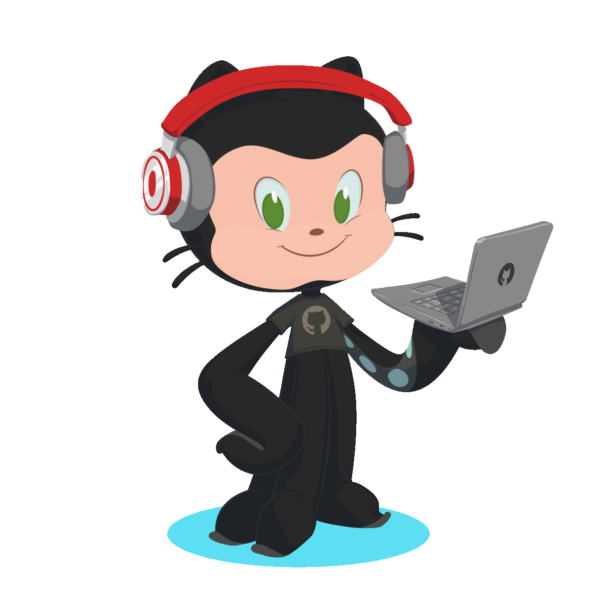

## Hello World 

I'm Ludovico Besana, a QA Engineer and Full Stack Developer. I Spend most of my time discover bugs and problems on sites, applications, games and everything related to the web.

  
**What I'm working on** 👨🏻‍💻

- I am currently updating this readme with the most recent activities and projects

## Get in touch 🌎:

</a>

- [info@ludovicobesana.com](mailto:info@ludovicobesana.com) :mailbox:

 
 
 
 
 
#### Profile Visits :door:

  Stats :octocat:

#### GitHub Stats :bar_chart:

