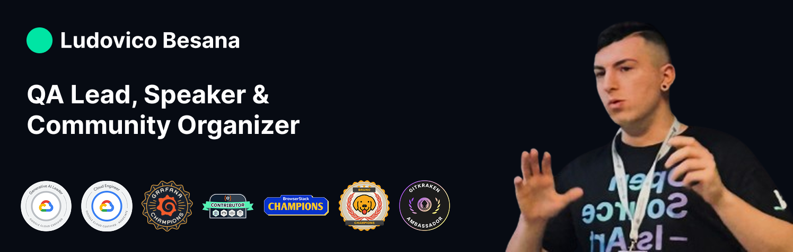

# Hi, I'm Ludovico 👋🏻

**QA Lead @Doctolib · Speaker · Community Organizer**

I work across quality engineering, observability, and AI to help teams make better software decisions.

[Website](https://ludovicobesana.com) · [LinkedIn](https://linkedin.com/in/ludovicobesana) · [YouTube](https://www.youtube.com/@ludovicobesana) · [X / Twitter](https://x.com/ludovicobesana)

## Next on stage 🎤

| When | Where | Details |
| :--- | :--- | :--- |
| **22 Sep 2026** | cAIo 2026 · Milan, Italy 🇮🇹 | [Programme & tickets →](https://ikn.it/chief-ai-officer/) |
| **30 Sep 2026** | Oracolo del Test Meetup · Milan, Italy 🇮🇹 | [Programme & tickets →](https://www.meetup.com/oracolo-del-test/events/315738175) |

[**Explore all talks & presentations →**](https://github.com/ludovicobesana/curriculum-vitae/blob/main/sections/Talks.md)

## Build technology that matters

At [Doctolib](https://www.doctolib.com/), we work to make healthcare simpler and more accessible.

Want to solve meaningful engineering challenges while improving healthcare?

[**Explore Tech opportunities at Doctolib →**](https://careers.doctolib.com/tech-doctolib/)

