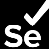

## Hello World 

I'm Ludovico Besana, a QA Engineer and Full Stack Developer. I Spend most of my time discover bugs and problems on sites, applications, games and everything related to the web.

#### Get in touch 

</a>
- [info@ludovicobesana.com](mailto:info@ludovicobesana.com) :mailbox:
 
 
 
 
 
 
 
<!-- WORK -->

  Work 👨🏻‍💻

 

- I am currently updating this readme with the most recent activities and projects so get ready and leave a **follow** to receive notifications
- I am developing a simple personal portfolio site --> https://www.ludovicobesana.com/ (Still in progress tho)

<!-- PERSONAL IMPROVEMENTS -->

  Study 📚

 

- I am currently studying [Jekyll](https://jekyllrb.com/) and experimenting with different testing tools including [SoapUI](https://www.soapui.org/) and [Cypress](https://www.cypress.io/)

<!-- TECH BACKPACK -->

  Backpack 🎒

##### Most used Languages & Frameworks:

 
 
 

##### Most used Tools & IDE:

 
 
 

##### My Distro:

 
 

<!-- COMMUNITY -->

  Community 🫂

<br/ >

- [Coding Bunker](https://www.codingbunker.it)

<!-- LAST VIDEO -->

  Last Video 📺

<br/ >

- https://youtu.be/zXMhyyEZtng

<!-- EVENTS -->

  Events  🎫

<br/ >

- Coming soon

<!-- GITHUB STATS -->

  Stats :octocat:

<br/ >

 

<!--  -->
